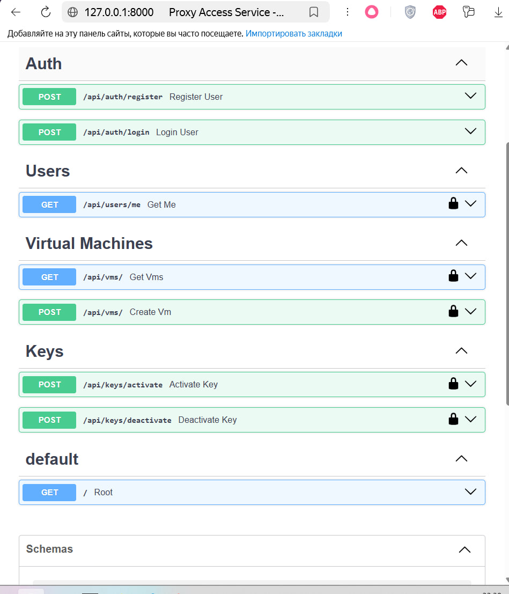

# Proxy Access Service

Сервис распределения виртуальных машин между пользователями.

## Стек

- Python 3.12
- FastAPI
- PostgreSQL
- Redis
- SQLAlchemy
- Docker
- JWT
- Swagger

## Возможности

- Регистрация пользователя
- Авторизация (JWT)
- Получение профиля
- Создание виртуальных машин
- Выдача свободной VM
- Освобождение VM
- Хранение данных в PostgreSQL

## Запуск

```bash
docker compose up -d
```

Swagger:

```text
http://127.0.0.1:8000/docs
```
## Swagger UI

Документация API:

http://127.0.0.1:8000/docs

Скрин:



## API

POST /api/auth/register

POST /api/auth/login

GET /api/users/me

POST /api/vms/

GET /api/vms/

POST /api/keys/activate

POST /api/keys/deactivate